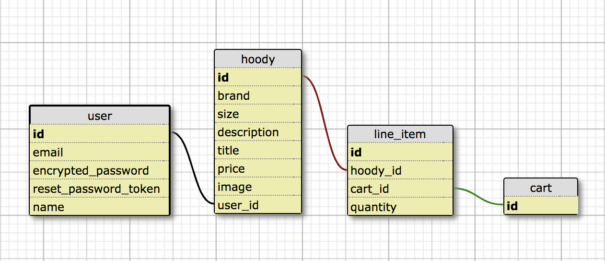
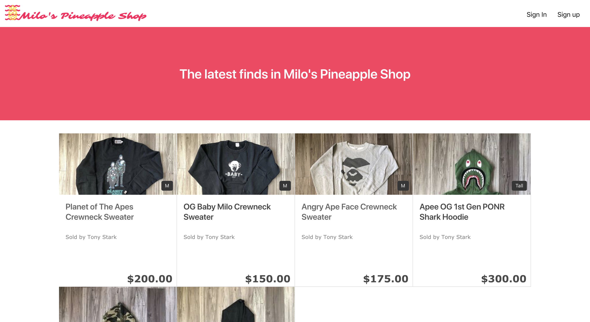

# README

## Heroku Link: [Milo's Pineapple Shop](https://lit-chamber-46433.herokuapp.com/)

Milo's Pineapple Shop is an e-commerce platform built with Ruby on Rails and utilizes Stripe API for payment processing, to buy and sell clothing to or from other users. Upon signing up, a user could post their own new items to sell or view listings from other users. The listing shows the brand, size, title, price, description and image of the item.




## Prerequisites

Rails version 5.2.1

## Launch

To launch locally, run the following commands in your terminal:

```
git clone https://github.com/Heybluguy/milos_pineapple_shop.git
cd milos_pineapple_shop
bundle
rails db:create
rails db:migrate
rails s
```
Open your browser and visit `localhost:3000` and interact with the interface.
